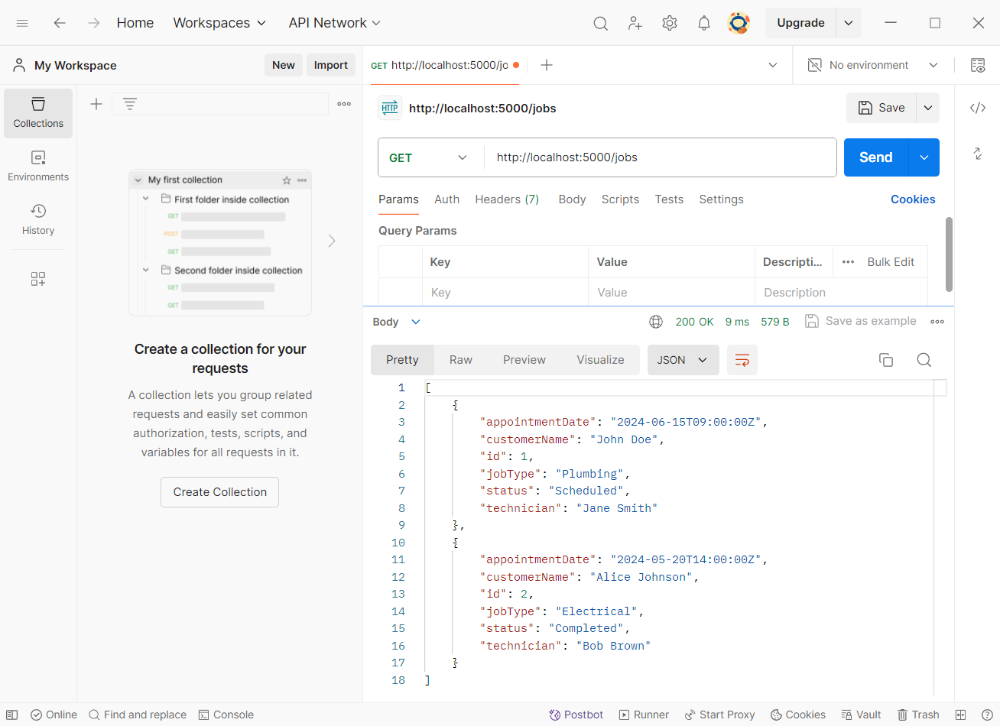

# ProfitFill / ADHOME Assignment

# Project Setup Guide

These below are my versions

Python 3.12.3

npm 10.5.2

NodeJS v20.13.1

## Backend Setup (Python Flask)

### 1. Create Python 3.12 Virtual Environment
```bash
python -m venv venv
```

### 2. Activate Virtual Environment
#### For macOS/Linux:
```bash
source venv/bin/activate
```
#### For Windows:
```bash
venv\Scripts\activate
```

### 3. Install Dependencies
```bash
cd backend
pip install -r requirements.txt
```

### 4. Run Flask Server
```bash
flask run
```


## Frontend Setup (React)

### 1. Install Node.js and npm
- Download and install Node.js from [nodejs.org](https://nodejs.org/).

### 2. Install Dependencies
```bash
cd frontend
npm install
```

### 3. Start Development Server
```bash
npm start
```


## Accessing the Application
- Once both the backend Flask server and frontend development server are running, you can access the application in your web browser at `http://localhost:3000`.

# Backend Tests

I use POSTMAN software to test if the Backend working properly
## Get All Jobs

GET request to http://localhost:5000/jobs



## Get A Job by Id 

I check with id = 2, so it is a GET request to http://localhost:5000/jobs/2


## Return Error if Get a Wrong ID

I check with id = 6 that there is no job with id = 6, so it is a GET request to http://localhost:5000/jobs/6


## Return Error if Add an Existing Job

I try to send POST request to re-add the whole job content of Job #2. So it is a POST request to http://localhost:5000/jobs 


## Return Error if Add a Job without a Name

I try to send POST request to add a new job but I suppose to forget the customer name. So it is a POST request to http://localhost:5000/jobs 


## Return the New Job if Added Successfully

So it is a POST request to http://localhost:5000/jobs 


After that, I can re-check if the Job can be listed


## Return Error if Update (PUT) with a wrong Job ID

I check with id = 4 that there is no job with id = 4, so it is a PUT request to http://localhost:5000/jobs/4


## Update (PUT) a Job successfully

I update the newly added job with id = 3, so it is a PUT request to http://localhost:5000/jobs/3


## Return Error if Delete a Job by a Wrong ID

I check with id = 4 that there is no job with id = 4, so it is a DELETE request to http://localhost:5000/jobs/4


## Delete a Job Successfully

I delete the newly added job with id = 3, so it is a DELETE request to http://localhost:5000/jobs/3


# Frontend Tests

I checked Frontend on Internet Explorer

http://localhost:3000

## Job List View


## Job Details View


## Add Job Form

If successfully added


After added, I re-list all the jobs to see the new one


## Update a Job


## I click the X button on the Job List to delete Job #3

